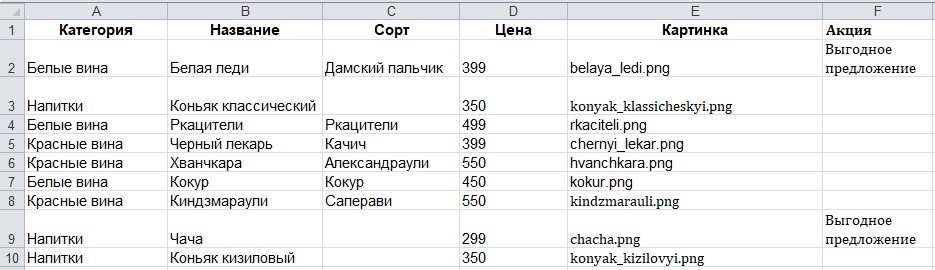

# Новое русское вино

Сайт магазина авторского вина "Новое русское вино".

## Запуск

- Скачайте код
- Установите значение переменной окружения `WINE_DRINKS_FILE_PATH`. 
В этой переменной указывается путь к Excel-файлу, в котором содержатся данные по напиткам для сайта. 
Например: `wine.xlsx`
###### Пример содержимого файла с данными о напитках:

- Запустите сайт командой `python3 main.py`
- Перейдите на сайт по адресу [http://127.0.0.1:8000](http://127.0.0.1:8000).

## Цели проекта

Код написан в учебных целях — это урок в курсе по Python и веб-разработке на сайте [Devman](https://dvmn.org).
